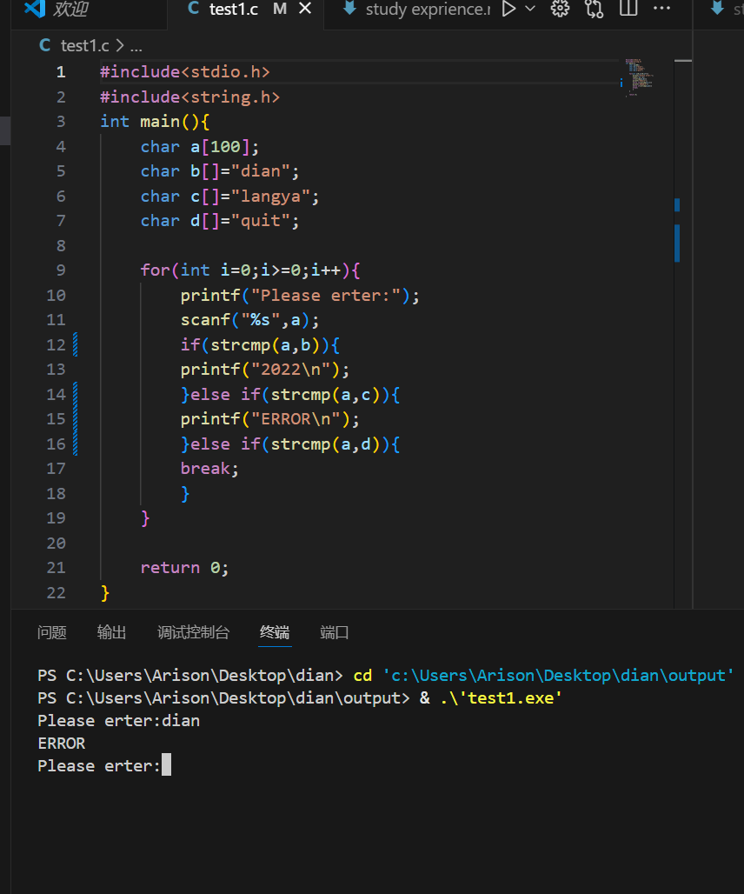
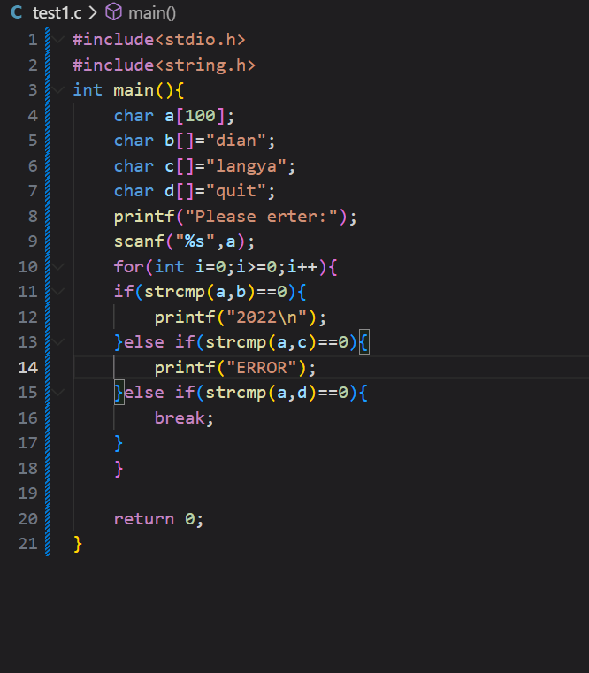

* 前言：本文档用于记录记录完成任务过程中的各种问题及心得等，本人编程基础约为0，属于典型现学型选手，纵使不能加入dian团队，也相信会受益匪浅。

* TEST 1：

   完成时间：2025.9.8，历时2days.

   Test 1的编程感觉很简单，但是在编译过程中也遇到了一些问题并学到了一些东西.

   在test 1的完成过程中，我了解到除了*stdio.h*以外的头文件如*string.h*和*stdlib.h*，其中由于使用字符串数组，我了解了*string.h*，让编程中的字符串有了更多可操作性，同时顺带了解了*stdlib.h*,并学会了申请内存等基本操作.

   当然在此也遇到了一些问题，比如以前我惯用scanf后加上&，但是后来了解到，字符串数组本身就自带指针，不需&.同时，我学到了字符串的等于并非简单的==，而是应该引用库函数strcmp（），当然在此过程遇到了问题，比如，后来看到别的编程教学了解到要加上==0，至于原因，稍后探寻。还有遇到了逻辑错误，比如，这个错误导致了无限循环，后来便把执行动作放在了循环里面。Test 1且到这里，还有疑问，应该会在后续补档。