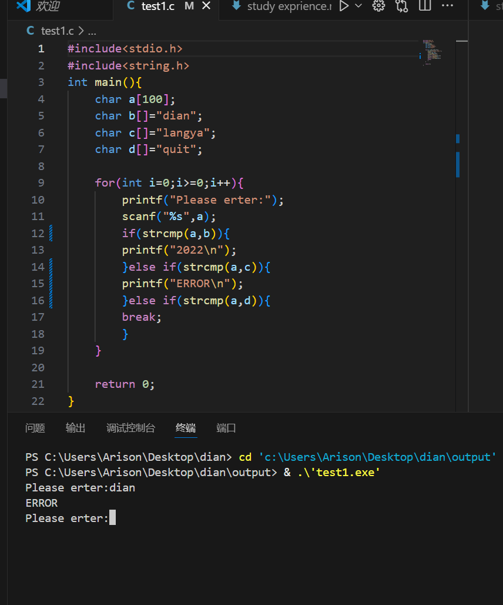
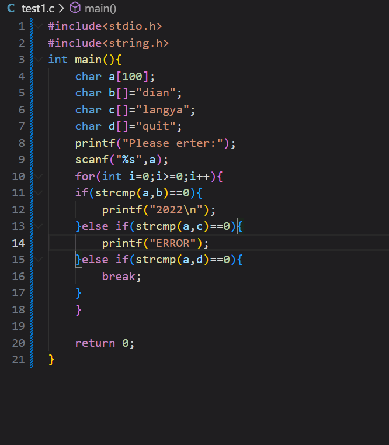
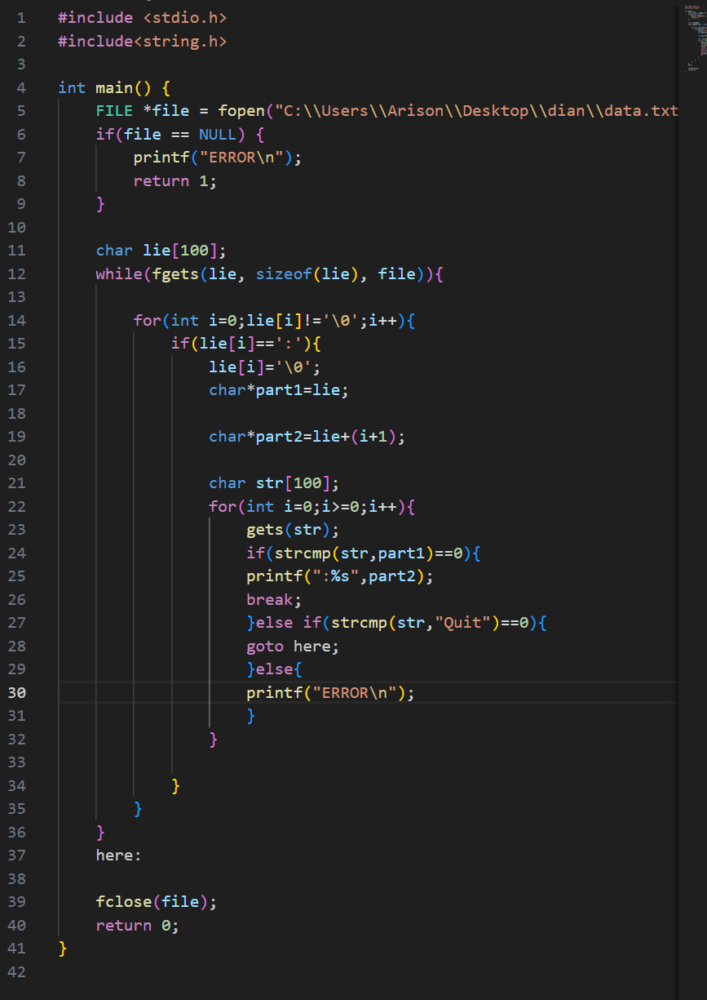
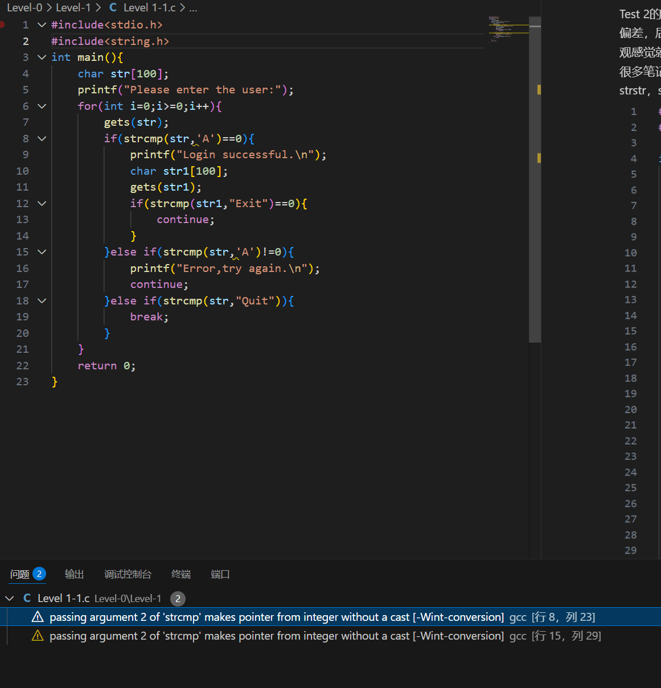

* # 前言：本文档用于记录记录完成任务过程中的各种问题及心得等，本人编程基础约为0，属于典型现学型选手，纵使不能加入dian团队，也相信会受益匪浅。
此过程中，我自学了基本数据类型，程序控制语句，函数，数组，文件读写等。

* # TEST 1：

   完成时间：2025.9.8，历时2days.

   Test 1的编程感觉很简单，但是在编译过程中也遇到了一些问题并学到了一些东西.

   在test 1的完成过程中，我了解到除了*stdio.h*以外的头文件如*string.h*和*stdlib.h*，其中由于使用字符串数组，我了解了*string.h*，让编程中的字符串有了更多可操作性，同时顺带了解了*stdlib.h*,并学会了申请内存等基本操作.

   当然在此也遇到了一些问题，比如1.以前我惯用scanf后加上&，但是后来了解到，字符串数组本身就自带指针，不需&.

   2.同时，我学到了字符串的等于并非简单的==，而是应该引用库函数strcmp（），当然在此过程遇到了问题，

   3.比如，后来看到别的编程教学了解到要加上==0，至于原因，稍后探寻。
   
   4.还有遇到了逻辑错误，比如，这个错误导致了无限循环，后来便把执行动作放在了循环里面。Test 1且到这里，还有疑问，应该会在后续补档。

   5.整点活吧，能不能引入动态内存呢？

   显然没有时间了。。。


补档：strcmp加上==0，是因为函数返回值是0.    记于2025.9.10.0：05
* # Test 2:

  
  完成时间2025.9.9，历时1day。

  Test 2的编程感觉难度有所提升，我也去学习了一些东西。首先我在对题目的理解上有一些偏差，后来在室友的提点下，才开始学习字符串分割，文件读写等相关知识。我对此的直观感觉就是，文件读写和字符串分割很好上手，但是想用熟练还是需要大量练习，我记了很多笔记，比如学习了库函数fgets，get，fopen，fclose，以及strcpy，strcat，strcmp，strstr，strcspn等，在敲代码过程中也以笔记作了参考.

  我的思路是把文件全部读下来，每一行字符串都做一个分割，然后输入的字符串与每行第一个字符串比较，相同就输出第二个字符串。最后的完整代码是，当然在这个过程中遇到了问题。比如：1.我一开始疑惑fgets为什么要放在while里面，后来发现是由于fgets一次只能读一行。

  2.再次，在分割字符串的时候，我采用了指针，却疑惑在printf时为什么不用*调用指针，请教了ai才发现了%s与%c的区别。

  3.同时我还发现一个问题，就是这个程序必须按行依次输入键才会输出相应的值，有没有办法输入一个键就能输出一个值而不需要按照顺序呢？这个问题留给后面吧。

  补档：9.27
  做完之后回来看，确实可以实现上面的想法，只要改一下，改为先读取解析所有数据，再进行查询就可以了。

* # Level 1-1

完成时间：2025.9.10

我觉得这个小任务不算难吧...思路也比较清晰，使用continue来重复循环达到Exit的目的，当然我感觉我的代码有点怪怪的，似乎条件分支有点混乱，用了好多重复的条件，用while会不会好一点？这个问题留在这后续再看吧.

在过程中遇到了一点问题：也是在这里我意识到strcmp函数是字符串与字符串的比较，而‘’只是字符，要加上""成为字符串.
这一步就这么多。
  

  * # Level 1-2

  虽然很不愿意承认，但是我必须要说的是，Level 1-2我并没有严格完成，时间和基础有限，我并没有能力来搭建一个多天预约的系统.所以我从简出发，搭建了一个单日系统，只能显示当天的预约记录。我考虑过四维数组，但是很显然，那已经超出了我的能力范围，并且会异常麻烦。同时，A-Z的用户模式我也没有创建，我只设置了用户模式和管理员模式，并且为每一次预约的用户保存了id，不可否认的是，在这里我求助了ai，让ai为我调整了一下逻辑结构并定义了相关函数，我觉得Level 1-2对我而言，是一个挑战，为此我专门保留了ai的生成代码，那么接下来进入正文。

  其实我的想法非常简单，那就是真正的预约系统，用户会记住id，而管理员只在乎是否预约，所以我并没有精确到每个用户名。


原初代码是
```c
#include<stdio.h>
#include<string.h>
void clearInputBuffer() {
    int c;
    while ((c = getchar()) != '\n' && c != EOF);
}

int main(){
    int a;//a用于表示楼层
    int b;//b用于表示列
    int c;//c用于表示行
    int map[5][4][4]={0};
    char str[100];
    char str1[100];
    
    for( a=0;a<5;a++){
        printf("\n-%d-\n",a+1);
        for( b=0;b<4;b++){
            for( c=0;c<4;c++){
                printf("%d",map[a][b][c]);
            }
            printf("\n");
        }
    }
    here:
    printf("Friday Floor ");
    scanf("%d",&a);
    printf("\n-%d-\n",a);
    for(b=0;b<4;b++){
        for(c=0;c<4;c++){
            printf("%d",map[a-1][b][c]);
        }
        printf("\n");
    }
    printf("Reserve Monday Floor ");
    scanf("%d",&a);
    printf("Seat ");
    scanf("%d %d",&b,&c);
    map[a-1][b-1][c-1]=2;
    printf("Friday Floor ");
    scanf("%d",&a);
    clearInputBuffer(); // 清理缓冲区
    printf("\n-%d-\n",a);
    for(b=0;b<4;b++){
        for(c=0;c<4;c++){
            printf("%d",map[a-1][b][c]);
        }
        printf("\n");
    }
    
    gets(str);
    if(strcmp(str,"Reservation")==0){
        for( a=0;a<5;a++){
            for( b=0;b<4;b++){
                for( c=0;c<4;c++){
                    if(map[a][b][c]!=0){
                        printf("Friday Floor %d Seat %d %d\n",a+1,b+1,c+1);
                            
                    }
                }
            }
        }
    }
    
    //继续预约系统
    printf("Enter 'Continue' to make another reservation: ");
    gets(str1);
    if(strcmp(str1,"Continue")==0){
        goto here;
    }
    return 0;
}


看到楼层，行，列，我非常自然地想到了三维数组，因而搭建了一个上面的系统，但是在那个时候，我并没有区分管理员和用户系统,这也导致了后续搭建两个系统的时候以我的能力非常麻烦，一度接近崩溃，所以不得不求助ai，最后参考了ai之后，我的思路大概是：
首先登陆系统，选择管理员或者用户模式，然后会有OK，Quit，Exit三个选项，Quit提出程序，OK进入系统，Exit重新登陆，接着定义了查询每层楼的函数，壹角查询所有楼的函数（管理员专属），接着用if 和else进入两个分支。
    在用户模式下开始查询每层楼的座位并且选座位，每次登录的用户会有一个专属id，选完了之后会有Continue，意味这重新登陆，或者Quit退出程序。
    在管理员模式下能够查询所有楼层的预约情况,也能看到一层楼的情况，和用户模式一样，有continue等功能。（后面改成re-login了）。

思路讲完了，接下来讲讲我遇到的问题：
1.首先所有数组下标都是从零开始，这让我printf是需要作个转换，当然，这是小问题
2.其次是gets函数，一开始我使用gets函数，是因为它方便，并且不用去掉\n键，后来发现使用gets老是报错，于是改成了fgets。改成了fgets会发现回车后并没有运行程序，查阅资料才知道要删去换行符。有点is，同时由于scanf和fgets的同时存在，在scanf之后也要去掉换行符，虽然在这个代码中用不到，但应该是个好习惯，我为此还建立了一个函数。
3.同时可以看到，在判断管理员还是用户的时候，我用了三元运算符，这也是一个新学的东西，因为看到ai用此把数组里面的2打印成1，而不改变里面的值，所以我觉得非常实用。
```


* # Level 1-3
完成时间 2025.9.14

Level 1-3是接着Level 1-2写的，马不停蹄地写了2-3天（想用更多时间完成Level 2），学习了二进制的文件读写，同时加入了clear的函数，让管理员清空所有数据。二进制的文件读写确实方便，只用学习fwrite与fread函数即可。思路是，每次运行程序，就把数组和用户id读取一下，其中id的read是在Enter（），登陆系统的函数里面执行的，以便于在运行过程中也能读取（原因后面讲）。同时每次有人预约，就会把改变之后的数组和id读入。

下面讲一讲遇到的问题吧：

1.在clear数据的时候，我迷惑了，因为我不知道什么函数能够重置数组，直到我找到了--memset。这个初始化函数，memset（数组名，0，sizeof（int）*字符数量），这里很有意思的是，我sizeof后面1不能直接用数组名，因为当素组座位函数参数传递时，它会退化成指针，成为地址，无法指向整个数组大小。

2.还有一点，在管理员使用clear的时候，我把文件里面的用户id删去了，但是在更换用户的时候，我发现我调用的Enter登录函数并没有读取文件里面的用户id值，为此我感到棘手，我原来以为int类型函数只能返回值，后来试着在int函数里面加上了执行动作的readuser函数操作，发现一样可以，让代码更加完整。

3在第一版的代码中，我喜欢用goto，但是随着代码越来越长，我发现goto会报错，查阅资料我发现了while（1）这个无限循环的函数，从而解决了这一问题。

4.同时，我在每次启动的时候加入了用户id读取的操作，这样一天的id就是从1开始井然有序了。

5.但是这一阶段最令我疑惑的是，怎么实现多开的能力呢？理论上来说确实具备了，但是同时运行显然会造成撞车的情况（因为我没有引入文件锁）。

此阶段问题就这么多，后面可能补档的。

* # LEVEL 2
完成时间 2025.9.24
Level 2完成是一个不断改进的过程，一开始为管理员添加了一个允许暂时签到离开和去除超时座位的功能。这都还好，并没有多大难度。但是后面我想加入预约时间段这一功能，比如在14.00到15.00预约的功能，但是这给我的挑战确实不小。第一次编译报了11个警告，确实不是很容易，为此我问了ai，在ai生成的代码基础上做了修改，初步实现了这一功能。
在初步实现这一功能后，我发现我的功能存在问题，一个用户预约之后，就不能其他用户预约了，即使时间段是错开的，为此，我想再度改进。
```c
#include <stdio.h>
#include <string.h>
#include<time.h>
//增加了管理员登记用户临时签离开的情况
//增加了管理员强制清除不按时返回的用户座位的功能

typedef struct 
{
    int start_hour;
    int end_hour;
}Time;
typedef struct{
    int user_id;
    time_t reserve_time;
    Time time1;
}Request_inform;
typedef struct{
    Request_inform reservation;
    int is_occupied;
}Seat;
Seat map[5][4][4];

void clearInputBuffer() {
    int c;
    while ((c = getchar()) != '\n' && c != EOF);
}
void readData(){//定义读取数据的函数
    FILE *file=fopen("Reservations.bin","rb");
    if(file==NULL){
        for (int f = 0; f < 5; f++) {
            for (int r = 0; r < 4; r++) {
                for (int c = 0; c < 4; c++) {
                    map[f][r][c].is_occupied = 0;
                    memset(&map[f][r][c].reservation, 0, sizeof(Request_inform));
                }
            }
        }
        return;
    }
    
    fread(map,sizeof(Seat),5*4*4,file);
    fclose(file);
}
void readUser(int* userCounter){//定义读取用户id的函数
    FILE *file=fopen("User.bin","rb");
    if(file==NULL){
        return;
    }
    fread(userCounter,sizeof(int),1,file);
    fclose(file);
}
void writeUser(int userCounter){//储存用户id的函数
    FILE *file=fopen("User.bin","wb");
    fwrite(&userCounter,sizeof(int),1,file);
    fclose(file);
}
void writeData(){//储存数据的函数
    FILE *file=fopen("Reservations.bin","wb");
    fwrite(map,sizeof(Seat),5*4*4,file);
    fclose(file);
}
void clear(){//clear函数
    FILE *file=fopen("Reservations.bin","wb");
    for(int f=0;f<5;f++){
        for (int r = 0; r < 4; r++) {
            for (int c = 0; c < 4; c++) {
                map[f][r][c].is_occupied = 0;
                memset(&map[f][r][c].reservation, 0, sizeof(Request_inform));
            }
        }
    }
    fwrite(map,sizeof(Seat),5*4*4,file);
    fclose(file);
    printf("clear successful");
}
int TimeConflict(Time time1,Time time2){
    return(time1.start_hour<time2.end_hour&&time1.end_hour>time2.start_hour);
}
void formatTime(Time time,char*buffer){
    sprintf(buffer,"%02d:00-%02d:00", time.start_hour, time.end_hour);
}

// 自动清理所有过期的预约
void cleanupAllExpiredReservations(Seat map[5][4][4]) {
    time_t now = time(NULL);
    struct tm *current_time = localtime(&now);
    
    for (int f = 0; f < 5; f++) {
        for (int r = 0; r < 4; r++) {
            for (int c = 0; c < 4; c++) {
                
                
                if (map[f][r][c].is_occupied) {
                    // 如果当前时间超过预约结束时间，自动清除
                    if (current_time->tm_hour >= map[f][r][c].reservation.time1.end_hour) {
                        map[f][r][c].is_occupied = 0;
                    }
                }
            }
        }
    }
    writeData();
}

int canReserveSeat(Seat *seat, Time new_slot) {
    // 如果座位完全空闲，可以直接预约
    if (!seat->is_occupied) {
        return 1;
    }
    
    // 如果座位已被预约，检查时间段是否冲突
    Time existing_slot = seat->reservation.time1;
    
    // 检查时间段是否重叠
    int has_conflict = (new_slot.start_hour < existing_slot.end_hour && 
                        new_slot.end_hour > existing_slot.start_hour);
    
    return !has_conflict; // 无冲突返回1，有冲突返回0
}

void reserveSeat(int floor,int row,int c, int user_id){//预约座位的函数
    Time time1;//预约约时间段
    printf("Enter start hour (0-23): ");
    scanf("%d", &time1.start_hour);
    printf("Enter end hour (0-23): ");
    scanf("%d", &time1.end_hour);
    clearInputBuffer();
    
    char time_str[20];
    formatTime(map[floor][row][c].reservation.time1, time_str);
    
        
    if (map[floor][row][c].is_occupied && TimeConflict(time1, map[floor][row][c].reservation.time1)) {
            char time_str[20];
            formatTime(map[floor][row][c].reservation.time1, time_str);
            printf("Time conflict with seat at floor %d, row %d, col %d (%s)\n",floor+1, row+1, c+1, time_str);
            return;
        }else{
            map[floor][row][c].is_occupied=user_id;
            map[floor][row][c].reservation.user_id=user_id;
            map[floor][row][c].reservation.time1=time1;
            map[floor][row][c].reservation.reserve_time=time(NULL);
            void writeData();
            printf("Reserve successful");
        }
    
}    
void Leave(Seat map[5][4][4]){//签到暂时离开的函数
    int i;
    printf("Please enter the user's id:");
    scanf("%d",&i);
    clearInputBuffer();
    for (int floor = 0; floor < 5; floor++) {
        for (int row = 0; row < 4; row++) {
            for (int c = 0; c < 4; c++) {
                if (map[floor][row][c].is_occupied == i) {
                    map[floor][row][c].is_occupied = -i;
                }
            }
        }
    }
    void writeData();
}
void Return(Seat map[5][4][4]){//签到回来的函数
    int i;
    printf("Please enter the user's id:");
    scanf("%d",&i);
    clearInputBuffer();
    for (int floor = 0; floor < 5; floor++) {
        for (int row = 0; row < 4; row++) {
            for (int c = 0; c < 4; c++) {
                if (map[floor][row][c].is_occupied == -i) {
                    map[floor][row][c].is_occupied = i;
                }
            }
        }
    }
    void writeData();
}

int Enter(int isAdmin,int* userCounter) {//定义登录函数
    char username[100];
    readUser(userCounter);//每次登录，系统都读取用户数据

    while (1) {
        printf("Please enter the username (or 'Quit' to exit): ");
        fgets(username, sizeof(username), stdin);
        username[strcspn(username, "\n")] = '\0';

        if (strcmp(username, "Quit") == 0) {
            isAdmin=-1;
            return isAdmin;
            
        }
        else if (strcmp(username, "A") == 0) {
            printf("User login successful.\n");
            isAdmin = 0;
            break;
        }
        else if (strcmp(username, "admin") == 0) {
            printf("Admin login successful.\n");
            isAdmin = 1;
            break;
        }
        else {
            printf("Error, try again.\n");
        }
    }


    char command[100];
    while (1) {
        printf("Enter OK to continue, Exit to re-login, or Quit to exit: ");
        fgets(command, sizeof(command), stdin);
        command[strcspn(command, "\n")] = '\0';

        if (strcmp(command, "OK") == 0) {
            return isAdmin;
            
        }
        else if (strcmp(command, "Exit") == 0) {
            return Enter( isAdmin,userCounter);
        }
        else if (strcmp(command, "Quit") == 0) {
            isAdmin=-1;
            return isAdmin;
            
        }
        else {
            printf("Error command.\n");
        }
    }
}

void displayFloor(int floor) {//定义查询一层楼的函数
    printf("\nFloor %d:\n", floor);
    for (int row = 0; row < 4; row++) {
        for (int c = 0; c < 4; c++) {
            printf("%d ", map[floor-1][row][c].is_occupied);
        }
        printf("\n");
    }
}

void displayAllReservations() {//属于管理员的函数，查询所有座位
    printf("\nAll reservations:\n");
    for (int floor = 0; floor < 5; floor++) {
        for (int row = 0; row < 4; row++) {
            for (int c = 0; c < 4; c++) {
                if (map[floor][row][c].is_occupied != 0) {
                    char time_str[20];
                    formatTime(map[floor][row][c].reservation.time1,time_str);
                    printf("Floor %d, Seat %d-%d (User %d)for%s\n", 
                           floor+1, row+1, c+1, map[floor][row][c].is_occupied,time_str);
                }
            }
        }
    }
}

int main() {    
    int userCounter = 1; // 用于分配用户ID
    int isAdmin = 0;
    Enter(isAdmin,&userCounter);
    readData();//读取座位号
    cleanupAllExpiredReservations(map);
    if (isAdmin == -1) {
        printf("Program exited.\n");
        return 0;
    }

    char command[100];
    
    readUser(&userCounter);//读取用户id
    int currentUserId = isAdmin ? 0 : userCounter++; // 管理员ID为0，普通用户从1开始
    writeUser(userCounter);//读入用户id
    while (1) {
        
        if (isAdmin == 0) { // 用户
            printf("\nOptions: View floor, Reserve seat, Re-login, Quit\n");
            printf("Enter command: ");
            fgets(command, sizeof(command), stdin);
            command[strcspn(command, "\n")] = '\0';
            if (strcmp(command, "View floor") == 0) {
                int floor;
                printf("Enter floor number (1-5): ");
                scanf("%d", &floor);
                clearInputBuffer();//清除\n
                
                if (floor >= 1 && floor <= 5) {
                    
                    displayFloor(floor);//调用查询座位函数
                } else {
                    printf("Invalid floor number.\n");
                }
            }
            else if(strcmp(command, "Reserve seat") == 0) {
                int floor, row, c;
                printf("Enter floor number (1-5): ");
                scanf("%d", &floor);
                printf("Enter seat (row column, e.g., 1 2): ");
                scanf("%d %d", &row, &c);
                clearInputBuffer();//清除                
                if (floor >= 1 && floor <= 5 && row >= 1 && row <= 4 && c >= 1 && c <= 4) {
                    if (map[floor-1][row-1][c-1].is_occupied == 0) {
                        reserveSeat(floor,row,c, currentUserId);
                    } else {
                        printf("Seat already occupied by user %d.\n", map[floor-1][row-1][c-1].is_occupied);
                    }
                } else {
                    printf("Invalid input.\n");
                }
            }
            else if(strcmp(command, "Quit") == 0) {
                break;
            }else if(strcmp(command, "Re-login") == 0) {
                // 切换到另一个用户
                isAdmin = Enter(isAdmin,&userCounter);
                if (isAdmin == -1) break;
                currentUserId = isAdmin ? 0 : userCounter++;
            }
            else {
                printf("Unknown command.\n");
            }
        }
        else { // 管理员
            printf("\nOptions: View floor, View reservations, Clear,Re-login, Quit,Leave,Return,clearLeave\n");
            printf("Enter command: ");
            fgets(command, sizeof(command), stdin);
            command[strcspn(command, "\n")] = '\0';

            if (strcmp(command, "View floor") == 0) {//查询一个楼的座位
                readData();
                int floor;
                printf("Enter floor number (1-5): ");
                scanf("%d", &floor);
                clearInputBuffer();//清除换行符
                
                if (floor >= 1 && floor <= 5) {
                    printf("\nFloor %d (0=available, number=user ID):\n", floor);
                    displayFloor(floor);
                } else {
                    printf("Invalid floor number.\n");
                }
            }else if(strcmp(command, "View reservations") == 0) {
                displayAllReservations();//调用管理员专属函数
            }else if(strcmp(command, "Quit") == 0) {
                break;
            }else if(strcmp(command, "Re-login") == 0) {
                // 切换到另一个用户
                isAdmin = Enter(isAdmin,&userCounter);
                if (isAdmin == -1) break;
                currentUserId = isAdmin ? 0 : userCounter++;
            }else if(strcmp(command, "Clear") == 0){
                clear(map,&userCounter);//清除数据
            }else if(strcmp(command, "Leave") == 0){
                Leave(map);//执行临时签到离开操作
            }else if(strcmp(command, "Return") == 0){
                Return(map);//执行签到回来操作
            }else if(strcmp(command, "clearLeave") == 0){
                void cleanupAllExpiredReservations();//执行清除过期签到离开操作
            }else {
                printf("Unknown command.\n");
            }
        }
    }

    printf("Thank you for using the reservation system.\n");
    return 0;
}
```
我尝试着去实现一个座位分时段预约，我自己的代码长这样，但是我发现写到后面根本写不下去了，我没有方法实现一个储存不同时间段的座位结构体，求教ai后给出的也只是在原有的基础上覆盖了座位，有没有办法实现多时段预约同一个座位呢？

当然在这过程中我学到了了很多东西，下面来讲一下：

1.在这个过程中我发现函数实在是太多了，于是开始试着尝试结构体嵌套，确实方便

2.同时也了解了time.h头文件下的库函数，比如time_t,localtime（），difftime（）等

3.与此同时还了解到了sprintf的用法来格式化时间段为字符串

补档：2025.9.25，借助了ai工具，终于完成了分时间预约的功能，虽然800多行的代码里面有很多东西还不是太能看懂，但是我相信我最终可以handle的。 

最终通过链表结构完成了分时段预约功能，我为此专门在各大平台上花了两天时间学习了相关内容，同时更多地学习了相关内容让我对结构体有了一些深入理解。链表的学习让算法离我越来越近，同时我还积累了一个判断时间矛盾的算法。

                                                                                   2025.9.27


  后记：为期一个月的学习真的让我学到了很多，我不会忘记我熬夜学代码的精力，也不后悔我的选择，即使最后失之交臂，我亦问心无愧。                                                                                 